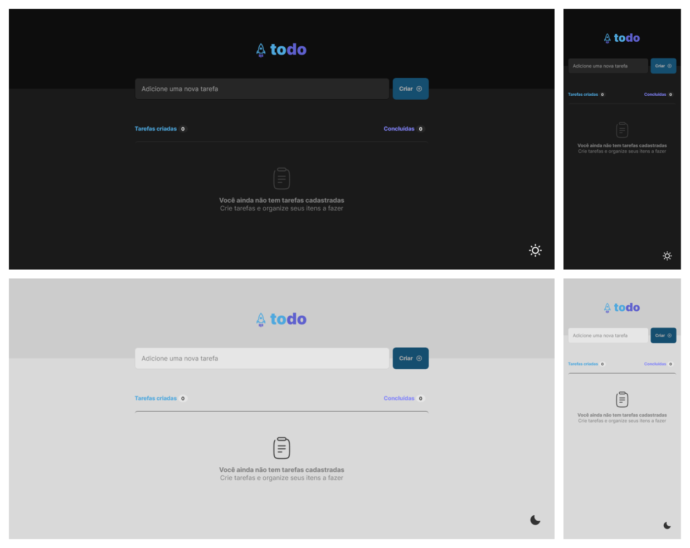

# To-Do List

## Table of contents

- [Overview](#overview)
  - [About](#about)
  - [Screenshot](#screenshot)
- [My process](#my-process)
  - [Built with](#built-with)
  - [What I learned](#what-i-learned)
- [Author](#author)

## Overview

### About

This is Rocketseat's first Ignite challenge, on the React JS track. It is a task control application, in the task list style, which contains the following functionalities:

- Add a new task
- Mark and unmark a task as complete
- Remove a task from the list
- Show task completion progress

### Screenshot

[Demo](https://to-do-list-keven.netlify.app/)

## My process

### Built with

- [Typescript](https://www.typescriptlang.org/)
- [React JS](https://reactjs.org/)
  - Context API
- [CSS Modules](https://github.com/css-modules/css-modules)
- [Vite](https://vitejs.dev/)
- [Vitest](https://vitest.dev/)
- [React Testing Library](https://testing-library.com/)

### What I learned

The challenge aims to remember the basic concepts of react, such as:

- States
- state immutability
- Lists and Keys in ReactJS
- properties
- Componentization

### Going beyond

To go a little further, I made some improvements to the project, such as:

- I created a small loading component using an animated svg, simulating the loading of information;
- I created a button that changes the application's theme between light and dark mode;
- Added unit tests, using Vitest and React Testing Library.

## Author

- [LinkedIn](https://www.linkedin.com/in/kevenpacheco/)
